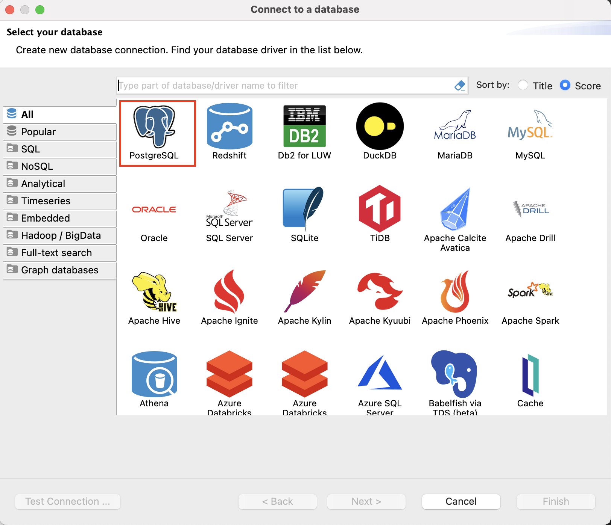
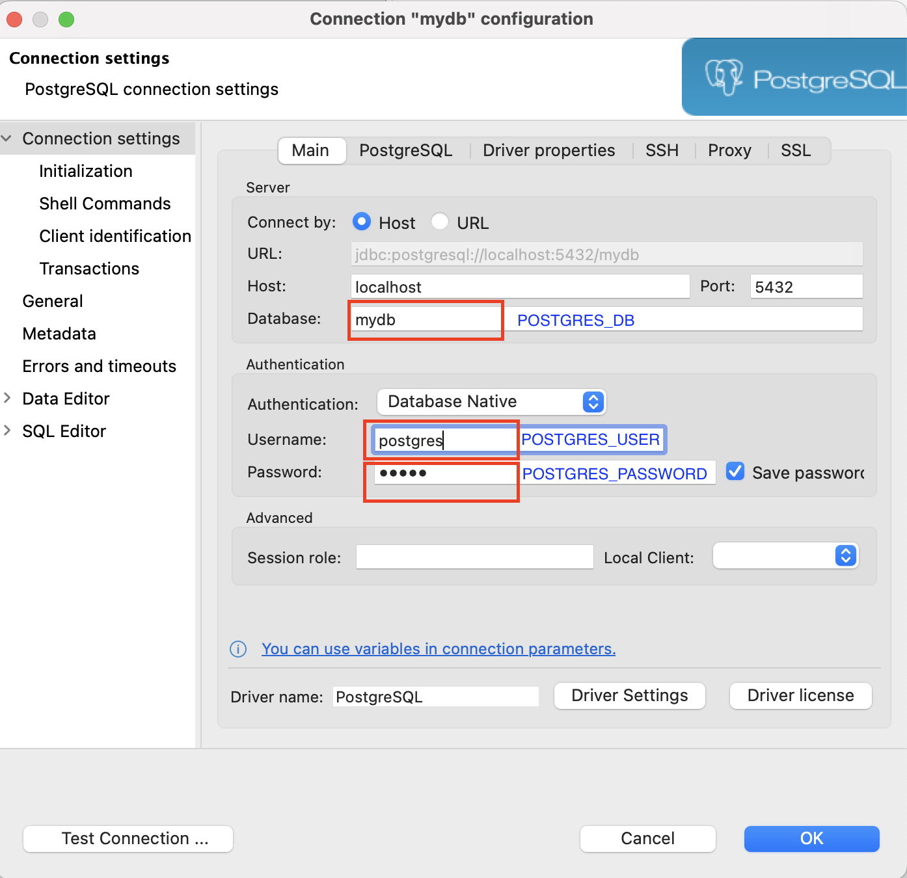
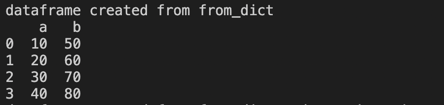
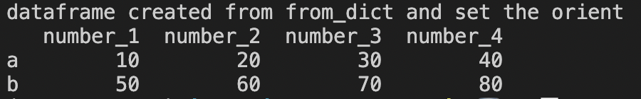
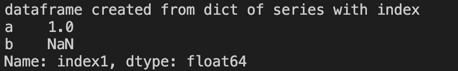
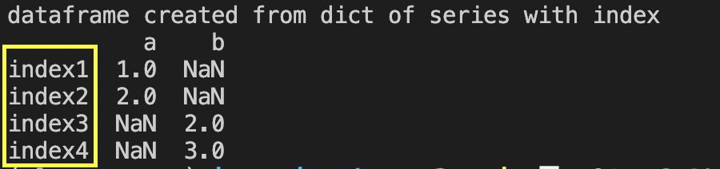
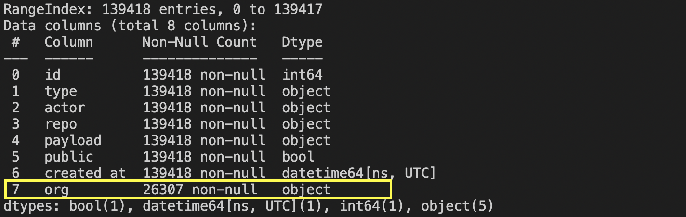
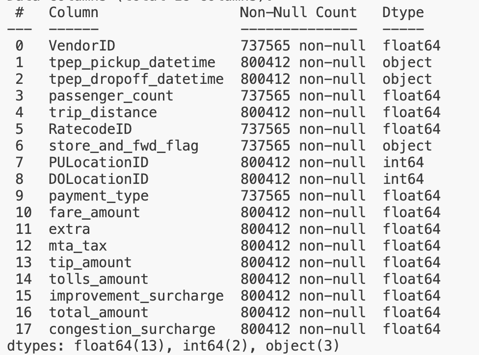

# Ingestion Data with Python (Part 1)

Prerequisites: 
1. Install virtualenv
2. Install Python libraries
3. Run postgresql service with docker-compose
4. Manage postgresql with DBeaver

Material:
1. Introduction to Pandas
2. Introduction to DataFrame
3. Ingestion Data to Postgresql


# Prerequisites

## 1. Install virtualenv

- check global installed python version 

```
    python --version
```

- Install virtualenv

```
    pip install virtualenv
```

- install python3.10 virtual environment locally

```
    virtualenv -p python3.10 venv
```
- activate virtual environment and check python version

```
    source venv/bin/activate
    python --version
```

## 2. Install Python libraries 

- Activate virtualenv
- We have a large number of libraries need to be installed, we can install all the packages at once by using the requirements.txt file. The syntax would be:

```
    pip install -r requirements.txt
```

## 3. Run postgresql service with docker-compose

To run Postgres with docker-compose we will create a [docker-compose-pg-only.yml](/docker-compose-pg-only.yml).

To start the containers, run this command: 

```
    cd ingestion_data
```

```
    docker-compose -f docker-compose-pg-only.yml up postgresql -d 
```


## 4. Manage postgresql with DBeaver

- Open DBeaver, then create `New Database Connection`
- Choose postgresql 
- Fill in the connection attributes as our settings on postgresql docker 

# Outline

## 1. Introduction to Pandas

Pandas is a Python library used for data manipulation and analysis. It provides data structures for efficiently storing and manipulating large datasets, as well as tools for data cleaning, filtering, and transformation.

## 2. Introduction to DataFrame

A DataFrame is a 2-dimensional data structure with columns of potentially different types, like a 2 dimensional array, or a table with rows and columns. It is generally the most commonly used Pandas object.

### a. Create a DataFrame

#### 1) Create a DataFrame from Arrays

- Open this [code](./ingestion_data/dataframe_from_arrays.py)
- The syntax is quite straightforward. We can pass the array data directly to pandas `DataFrame` method. The array could be a single or multidimensional array.

```

    arr_data = [ [10, 100, 1000], [40, 400, 4000]]
    df = pd.DataFrame(arr_data)

```
- Run `python ingestion_data/dataframe_from_arrays.py` and observe the result.


#### 2) Create a DataFrame from Dictionaries

- Open this [code](./ingestion_data/dataframe_from_dict.py)
- We want to specify how our data is laid out with `orient` parameter. `orient` is short for orientation. By default , `orient` value is `columns`, which means the keys of our dictionary to be the DataFrame column names. See the example below:

```
    dict_data = {"a": [10, 20, 30, 40], "b": [50, 60, 70, 80]}
    df_by_columns = pd.DataFrame.from_dict(dict_data, orient="columns")
    print("dataframe created from from_dict")
    print(df_by_columns)

```

- The output is: 




- If we set the `orient` value to `index` and set the column names, then the keys of our dictionary would be the index values of the DataFrame.

```

    dict_data = {"a": [10, 20, 30, 40], "b": [50, 60, 70, 80]}
    cols = ['number_1', 'number_2', 'number_3', 'number_4']
    df_by_index = pd.DataFrame.from_dict(dict_data, orient="index", columns=cols)
    print("dataframe created from from_dict and set the orient")
    print(df_by_index)

```

- The output is: 




#### 3) Create a DataFrame from Pandas `Series`

- Open this [code](./ingestion_data/dataframe_from_series.py)
- Pandas Series is a one-dimensional labeled array capable of holding data of any type (integer, string, float, python objects, etc.).
- By default, `Series` is assigned an integer index. The part of code below creates a DataFrame from `Series` with default integer index.

```

    s = {
        "a": pd.Series(range(1, 3)), 
        "b": pd.Series(range(2, 4))
    }

    df = pd.DataFrame(s)

```

- The output is: 




- Let's specify the index parameter on the `Series`, see the code below.

```

    s = {
        "a": pd.Series(range(1, 3), index=["index1", "index2"]),
        "b": pd.Series(range(2, 4), index=["index3", "index4"])
    }
    df = pd.DataFrame(s)


```

The output is: 




#### 4) Create a DataFrame from a local file 

- Open this [code](./ingestion_data/dataframe_from_file.py)
- In most cases, we read data from a file with formats, such as: `json`, `csv`, `excel`, and `parquet`. In this part, we will read a local csv file with `read_csv` function. This function creates a DataFrame from a csv file.

```

    df = pd.read_csv("dataset/sample.csv", sep=",")
    print("Print the first row")
    print(df.head(1))

```

- To read only some of the columns from the csv file with `usecols`. The code below reads data on column `tpep_dropoff_datetime` only, from `dataset/sample.csv`.

```

    df = pd.read_csv("dataset/sample.csv", sep=",", header=0, usecols=["tpep_dropoff_datetime"])
    print("only rad the tpep_dropoff_datetime column")
    print(df.head())

```

#### 5) Create a DataFrame from a URL with `read_json`

- Open this [code](./ingestion_data/ingest.py), go to the `__read_json_chunked(self)` method.

- We are going to create a DataFrame from a json-gzipped URL online: http://data.gharchive.org/2023-10-01-1.json.gz"

- The `read_json` function can read a `json` file from a local file or a URL and convert them into a DataFrame. By default, `read_json` assumes that the `json` file contains a list of objects, where each object represents a row in the DataFrame.

- We should specify the `compression` parameter to `gzip` before parsing the URL. 

- We set `chunksize` parameter and partially read the number of row of the JSON file. `chunksize` parameter is efficient to handle quite large data. 

```

    def __read_json_chunked(self) -> None:
        storage_options = {'User-Agent': 'pandas'}
        chunk_size = 50000
        with pd.read_json(self.url, lines=True, storage_options=storage_options, chunksize=chunk_size, compression="gzip") as reader: 
            for chunk in reader:
                self.dataframe = pd.concat([self.dataframe, chunk], ignore_index=True)
        print(self.dataframe.head())

```

#### 6) Create a DataFrame from a Parquet File

- In this part, we are going to create a DataFrame from a [parquet file](./dataset/yellow_tripdata_2023-01.parquet). 
- Parquet file is a column-oriented data file format designed for efficient data storage and retrieval. It provides efficient data compression and encoding schemes with enhanced performance to handle complex data in bulk ([source](https://parquet.apache.org/docs/overview/motivation/)).
- To load `parquet` data into a DataFrame:

```

    def __read_parquet(self):
        self.dataframe = pd.read_parquet(self.path, engine="pyarrow")

```

The default io.parquet.engine behavior is to try 'pyarrow’, falling back to 'fastparquet’ if 'pyarrow' is unavailable. Therefore, we need to install additional library via: `pip install pyarrow`.

### b. Indexing and Selecting Data in a DataFrame

Indexing means selecting particular rows and columns from a DataFrame. The code can be found [here](./ingestion_data/dataframe_from_file.py). 

There are several ways to do indexing with Pandas, some indexing methods are: 

- Select by columns with `[]` 
- Select by indexes/rows with `.loc[]`, `iloc[]`, `ix[]` 

#### Select by columns with `[]`

This function will select data from a DataFrame per column.

- Selecting single column

```

    df_single_col = df["passenger_count"]
    print("Selecting single column")
    print(df_single_col)
    print("--------------------")

```

- Selecting multiple columns

```

    df_multiple_cols = df[["VendorID", "passenger_count", "trip_distance"]]
    print("Selecting multiple columns")
    print(df_multiple_cols)
    print("--------------------")

```

- Run the python file and observe the result


#### Select by indexes/rows with `.loc[]`, `iloc[]`, `ix[]`

The differences between `.loc[]`, `.iloc[]` and `.ix[]` are: 
- `.loc` function is used to select rows by labels
- `.iloc` function is used for positions or integer based, and 
- `.ix` function is used for both label and integer based

To identify the index value of a DataFrame, use this command: `df.index`. 

Let's see some examples of subset selection by rows and columns with indexing functions.

- Selecting a single row

    To select a single row with `.loc[]`, put the row index inside brackets.

    ```

        df_single_row = df.loc[0]
        print("Selecting a single row, index 0")
        print(df_single_row)
        print("--------------------")

    ```

- Selecting multiple columns

    ```
        df_multiple_rows = df.loc[:5] # equal to df.loc[[0,1,2,3,4,5]]
        print("Selecting multiple rows, index 0-5")
        print(df_multiple_rows)
        print("--------------------")
    ```

- Selecting multiple rows and columns

    ```

        df_multiple_rows_cols = df.loc[:5, ["VendorID", "passenger_count", "trip_distance"]]
        print("Selecting multiple rows and cols")
        print(df_multiple_rows_cols)
        print("--------------------")

    ```

- Run the python file and observe the result

## TASK

1. We have already learned how to create DataFrame from files [here](#create-a-dataframe). Now, we are going to create a DataFrame from a larger [csv file](./dataset/yellow_tripdata_2020-07.csv) on our [datasets](./dataset/).
2. Rename all the columns with snake_case format.
3. Select only 10 top of highest number of `passenger_count`, show only columns `vendor_id, passenger_count, trip_distance, payment_type, fare_amount, extra, mta_tax, tip_amount, tolls_amount, improvement_surcharge, total_amount, congestion_surcharge` from the DataFrame.
4. [Extra] Cast the data type to the appropriate value.

# Ingestion Data with Python (Part 2)

## 3. Ingestion Data to Postgresql

In this part, before we are going to ingesting DataFrame to our data-warehouse, we have to do a simple data preprocessing including some following steps: 
- Investigate data in a DataFrame
- Casting to appropriate Pandas data types
- Cleaning Data with Pandas

### a. Investigate data in a DataFrame

The most used method for getting a quick overview of the DataFrame, is the `head()` method. The `head()` method returns the headers and a specified number of rows, starting from the top.

```
    # looking at DataFrame head data
    print("df head data ", self.dataframe.head())

```

The DataFrames object has a method called `info()` that gives information about the data set.

```
    # looking at DataFrame schema 
    print("df schema ", self.dataframe.info())

```

The result is: 



The info() method also tells us some information, such as: 
- total rows
- data type on each column. there are a column with boolean type, UTC datetime type, big integer type, and 5 columns with object type
- the number of `Non-Null` values present in each column
- the total number of `Null` and `Non-Null` values in each column

The `object` data type is used for columns that have a mixed type or if the data type is not known. We can use method `.infer_objects().dtypes` to better infer data type for an object data type.

### b. Cleaning Data with Pandas 

Cleaning data steps are fixing bad data in our DataFrame. Fixing bad data strategy can be various depending on our dataset and needs. 

When reading a file and loading it to a DataFrame, by default, pandas automatically infers and assigns the data type of each column based on the data it contains.
Suppose we are going to clean the [yellow_tripdata dataset](./dataset/yellow_tripdata_2020-07.csv). Let's see the initial data type infered by Pandas.



To decide the appropriate data type for each column, we have to look through the dataset and understand the context of the dataset. A column that have a mixed type (the rows contain integer and `null` values), pandas will infer the data type it as an `object`.

#### 1) Casting to appropriate Pandas data types

We have column `passenger_count` with data type `float64`. The number of passenger should not be a floating number, it must be an integer value. Use the code below to cast data type for `passenger_count` on  from `float64` to `Int8`

```
    self.dataframe["passenger_count"] = self.dataframe["passenger_count"].astype("Int8")

```
Then, to cast column from `object` to `datetime`, we can use this command:

```
    # `object` to `datetime`
    self.dataframe["tpep_pickup_datetime"] = pd.to_datetime(self.dataframe["tpep_pickup_datetime"])
    self.dataframe["tpep_dropoff_datetime"] = pd.to_datetime(self.dataframe["tpep_dropoff_datetime"])

```

#### 2) Managing `Null` values
- If the DataFrame contains `Null` values, we have various solutions, such as: 
    - remove the rows with `Null` values

        ```
            new_dataframe = self.dataframe.dropna()
        ```
        `dropna()` method returns new DataFrame, without changing the original one. If we want to replace the original DataFrame, add `inplace = True` parameter.

        ```
            self.dataframe.dropna(inplace=True)
        ```

    - replace the `Null` values with either 0, mean or median value

        ```
            new_dataframe = self.dataframe.fillna(0)
            
            # reflect in-place change
            self.dataframe.fillna(0, inplace = True)

            # fill null data on specified column
            self.dataframe["passenger_count"].fillna(0, inplace = True)
        ```

    - let the `Null` values be `Null`

#### 3) Manage boolean-like Value with Boolean value
- The `store_and_fwd_flag` column contains value `Y`, `N` and `Null` instead of `True` and `False` as Boolean. Therefore we need to replace flag with boolean value and cast the data type to boolean. The code would be: 
    ```
        self.dataframe["store_and_fwd_flag"] = self.dataframe["store_and_fwd_flag"].replace(["N", "Y"], [False, True])
        self.dataframe["store_and_fwd_flag"] = self.dataframe["store_and_fwd_flag"].astype("boolean")
    ```

### d. Load DataFrame to Postgresql

- Here is the code to load DataFrame to Postgresql. First of all, we need to establish connection to Postgresql with `sqlalchemy` library.

    ```
        def __create_connection(self):
            from sqlalchemy import create_engine 

            user = "postgres"
            password = "admin"
            host = "localhost"
            database = "mydb"
            port = 5432
            conn_string = f"postgresql://{user}:{password}@{host}:{port}/{database}"

            self.engine = create_engine(conn_string) 

    ```

- Then, use the connection to load DataFrame to Postgresql with `to_sql` method. In the `to_sql` method, we specify data schema of DataFrame, so that the Postgresql will create table based on the defined schema in `dtype` argument. In the code below, we use the schema for [github dataset](./dataset/2017-10-02-1.json).

```
    def to_postgres(self, db_name: str, data: pd.DataFrame):
        from sqlalchemy.types import BigInteger, String, JSON, DateTime, Boolean
        from sqlalchemy.exc import SQLAlchemyError

        self.db_name = db_name
        self.__create_connection()

        try:
            df_schema = {
                "id": BigInteger,
                "type": String(100),
                "actor": JSON,
                "repo": JSON,
                "payload": JSON,
                "public": Boolean,
                "created_at": DateTime,
                "org": JSON
            }

            data.to_sql(name=self.db_name, con=self.engine, if_exists="replace", index=False, schema="public", dtype=df_schema, method=None, chunksize=5000)
        except SQLAlchemyError as err:
            print("error >> ", err.__cause__)

```

### d. Check data in Postgresql with DBeaver

- Open DBeaver then refresh connection to our local postgresql
- Open new SQL script, then write this SQL syntax

```
    select count(1) from github_data

    # access json object in postgresql
    select actor, actor->>'id' as actor_id from github_data limit 100

```

## 4. Task

1. We are going to create a DataFrame from a [parquet file](./dataset/yellow_tripdata_2023-01.parquet) on our [datasets](./dataset/).
2. Load the parquet file to a DataFrame with `fastparquet` library.
3. Clean the Yellow Trip dataset.
4. Define the data type schema when using `to_sql` method.
5. Ingest the Yellow Trip dataset to PostgreSQL
6. Count how many rows are ingested.