# Ingestion Data with Airbyte (Part 1)
## Introduction to Airbyte

Airbyte is an open-source platform designed to streamline data integration tasks. It allows you to extract data from various sources, transform it into a suitable format, and load it into your preferred destinations, such as databases, data warehouses, or cloud storage.

## Why using airbyte for data ingestion?

Airbyte simplifies complex data integration processes. It offers a user-friendly interface, supports a wide range of sources and destinations, and automates data synchronization.

## Deploy Postgresql, Citus and Airbyte Locally via Docker-Compose

- Go to [ingestion_airbyte](./ingestion_airbyte/) directory.
- Make sure port 5432 is not occupied by any docker container otherwise run this command to list all the active containers, then select `container_id` with port 5432  
    ```
    docker ps 
    ``` 
- Stop the container (using port 5432) with this command
    ```
    docker stop <container_id>
    ``` 
- Run Postgreql, Citus and Airbyte locally via docker-compose
    ```
    docker-compose -f ingestion_airbyte/docker-compose.yml up
    ```
- Make sure all the services are up and running.
    

- Create connection on DBeaver to Postgresql and Citus with these credentials: 

```
    # Postgresql credential

    - Host: localhost:5432
    - Username: posgres
    - Password: pass
    - DB: store


    # Citus credential

    - Host: localhost:15432
    - Username: posgres
    - Password: pass
    - DB: store
```

## Setup Connection in Airbyte

- Open the Airbyte dashboard on [http://localhost:8000/](http://localhost:8000/) in browser, login with 
```
    - Username: airbyte
    - Password: password
```

- Then, create connection

    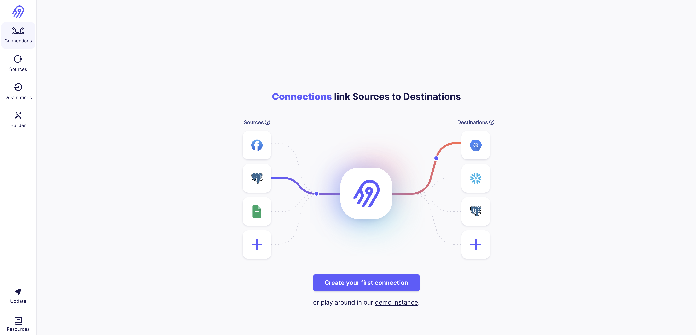


## Ingest from API to Postgresql

We are going to ingest data from this [file url](https://d37ci6vzurychx.cloudfront.net/trip-data/green_tripdata_2023-01.parquet) to Postgresql. 

First of all, let's define the new source from `File (CSV, JSON, Excel, Feather, Parquet)`. Then test and save it.

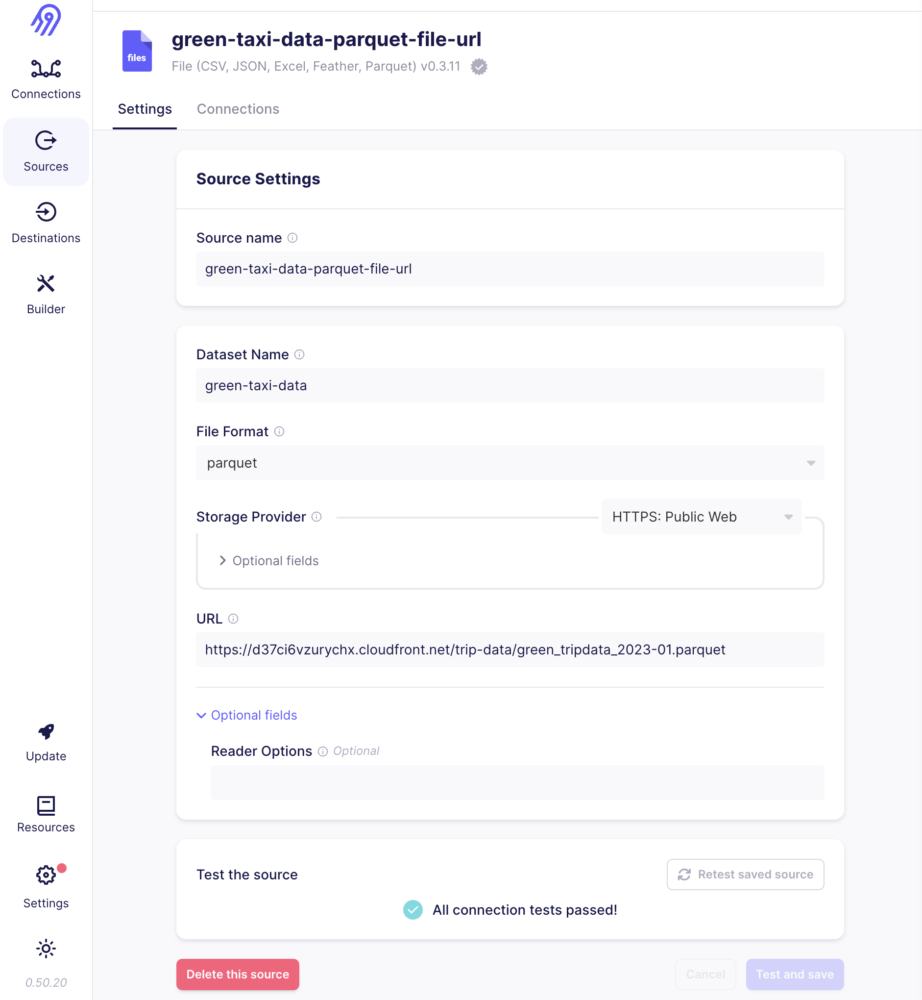

Next, we should define `New Connection`, add the `green-taxi-data-parquet-url` as the source 

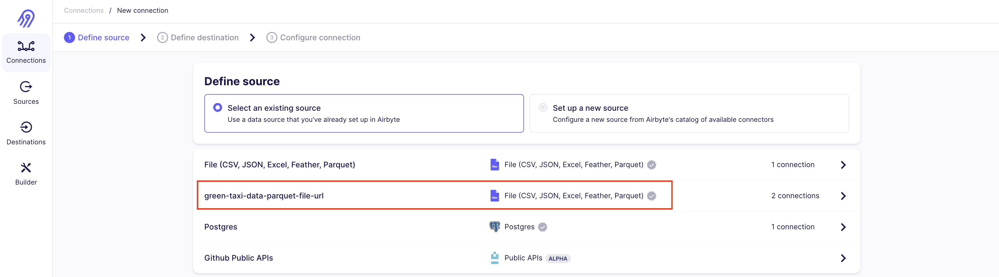

and Postgresql as the destination.

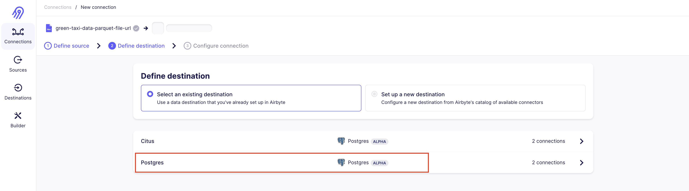

Fill out the connection setup configuration.

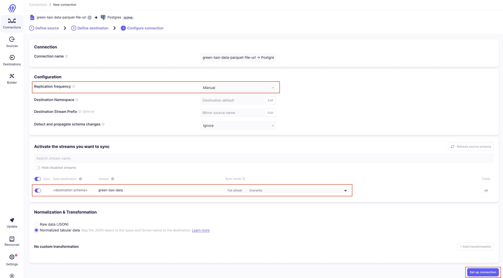

In the connection setup configuration: 
- set the frequency, to Manual. The options could be scheduled by Cron, Every 1, 2, 3, 6 to 24 hours.
- set the type of ingestion to overwrite or append.

Then start sync-ing the data stream from source to destination.

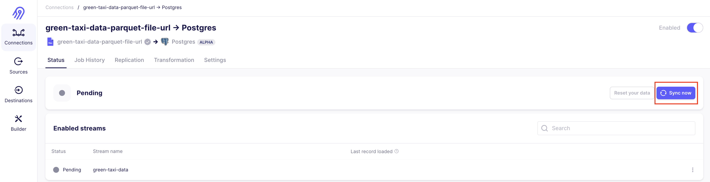

Once the data stream are succesfully ingested, the sync status will be shown like below:

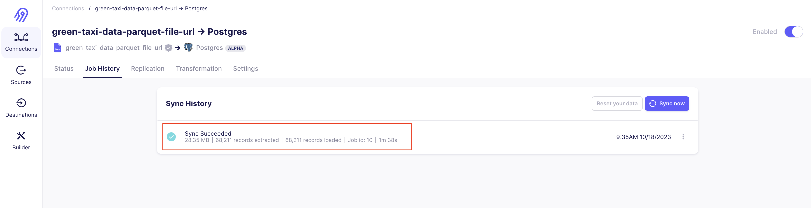

Let's check data in Postgresql.

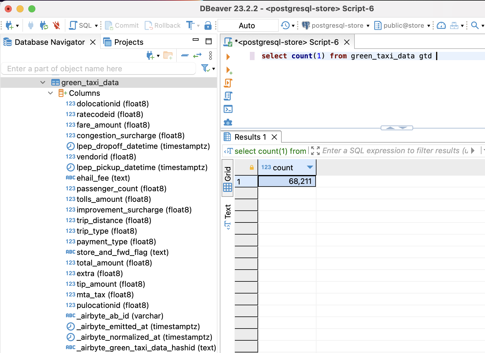


## TASK
1. Ingest data from [local file json](./dataset/2017-10-02-1.json) to Postgresql with Airbyte.
2. Count the number of rows ingested.

# Ingestion Data with Airbyte (Part 2)

## Ingest data from Postgresql to Postgresql Citus

- Define source 

    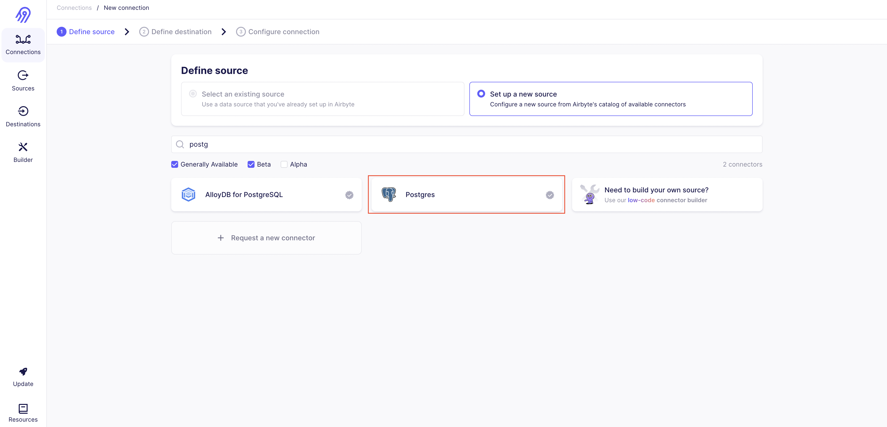

- Define postgresql connection detail (see config on [docker-compose](./ingestion_airbyte/docker-compose.yml))

    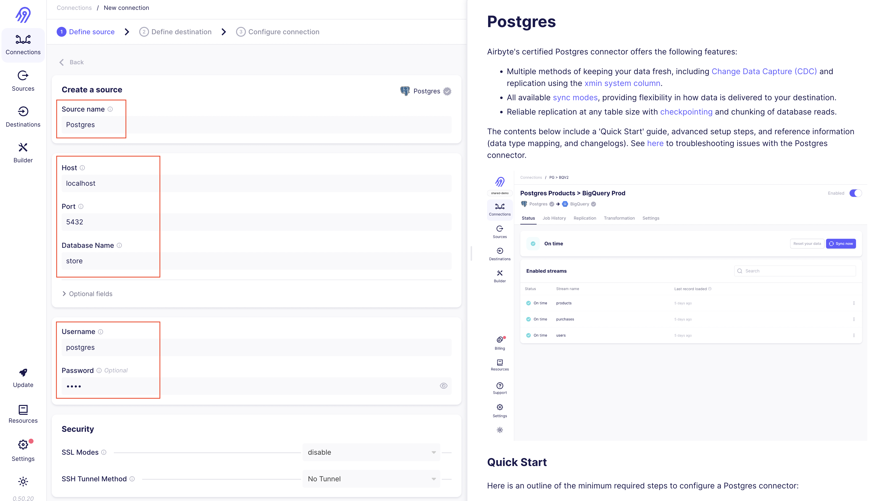

- define destination

    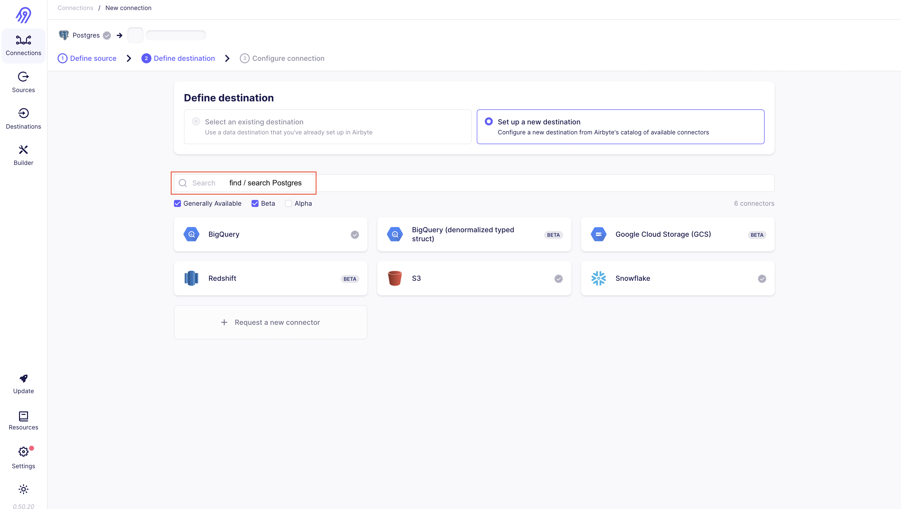

    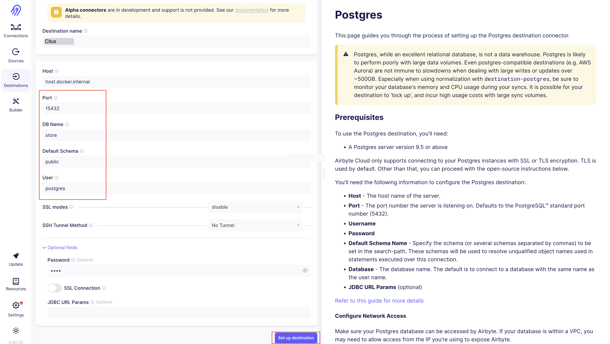

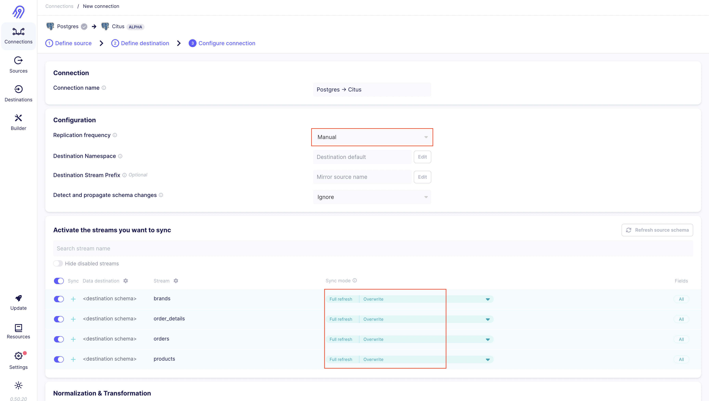


- Start synchronizing data

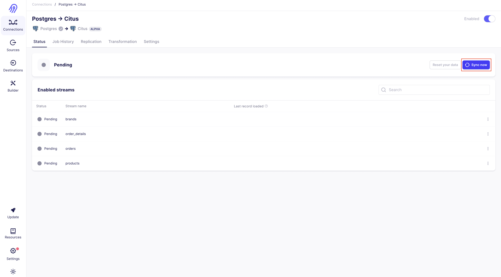

- Synchronizing status success 

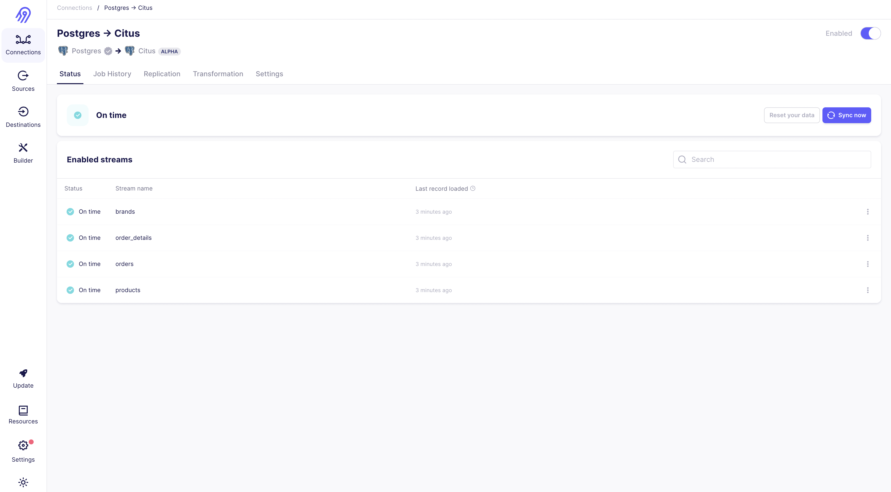

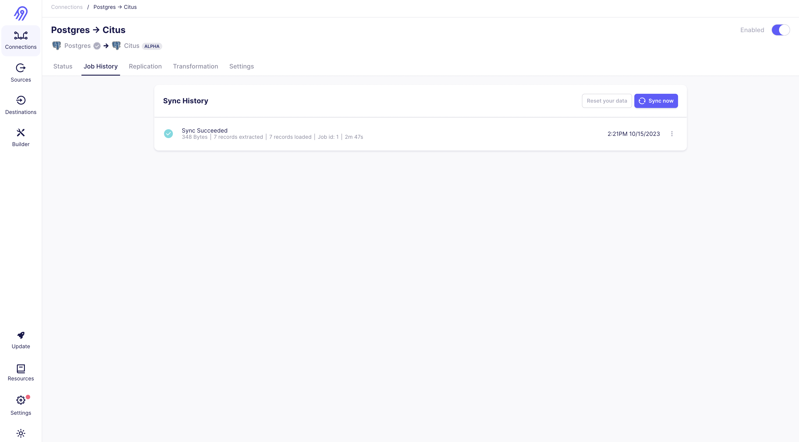


## TASK
We have already learned how tol ingest data from source to destination using Airbyte. It is pretty much simpler and require no-code at all. In this section, we also learned to ingest data from Postgresql to [Citus](https://docs.citusdata.com/en/stable/get_started/what_is_citus.html) with Airbyte. 

Now, let's have some fun. The today task is, you should create an ingestion data from Postgresql to Citus using Python.